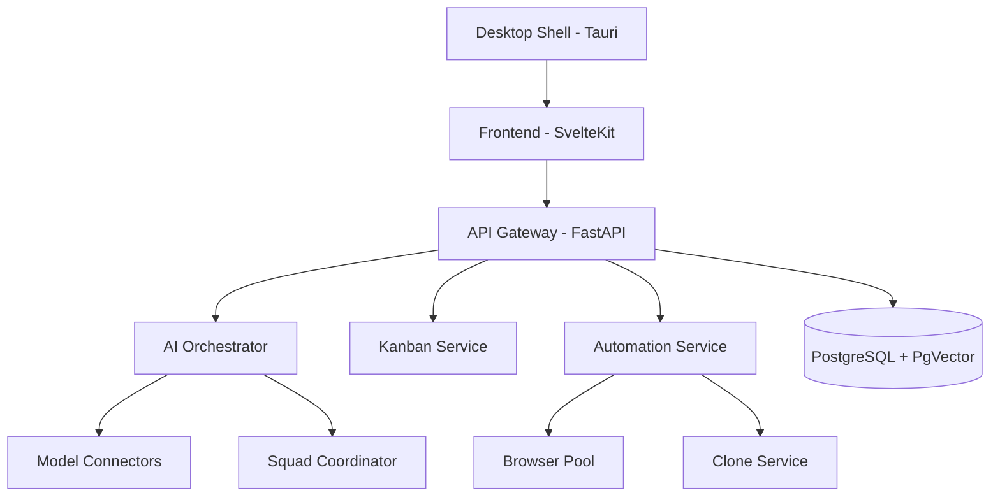

# santaclaude — Design & Implementation Plan (v0.4)

**Internal codename:** `santaclaude`\
**Status:** Updated with Chaos/Contract/Perf/Migration/Flag testing + risk coverage

---

## 0) Purpose & Scope

santaclaude is an AI‑augmented project workspace that fuses a Kanban‑driven PM interface with per‑task AI control and safe automation (browser actions, site cloning), delivered on the web and optionally packaged for desktop via Tauri. This plan enforces **testability** at every stage with clear Definition of Ready/Done, acceptance criteria, and phase gates, and now includes **advanced testing and chaos engineering**.

---

## 1) Non‑Negotiables (Quality Gates)

### 1.1 Definition of Ready (DoR)

A work item is **Ready** when:

- Acceptance criteria are written and testable.
- Telemetry and audit fields are specified (what to log, where, retention).
- Security, permissions, and fallback behavior defined (error/denied flows).
- Feature flag key and rollout strategy documented.

### 1.2 Definition of Done (DoD)

A work item is **Done** when:

- All acceptance tests pass (unit/integration/E2E), coverage **≥ 80%** for units.
- Observability: logs contain structured fields (`trace_id`, `user_id`, `project_id`, `action`, `status`).
- Security checks pass: **pip‑audit**, **Bandit**, container scan (**Trivy**), OWASP ZAP baseline.
- Docs: user‑facing help + admin runbook updated; ADR added if architecture changed.

### 1.3 SLOs & Budgets (apply from Phase 1 onward)

- API latency: **p95 < 200ms**; Kanban UI updates: **< 50ms**; AI routing: **< 100ms**.
- Error budget: **≤ 1%** 5xx over rolling 7 days.
- Realtime collab: merge‑conflict loss rate **0%** on OT test suite.

---

## 2) Architecture Snapshot



**Stacks:** SvelteKit+Tailwind, Monaco, Python 3.12 + FastAPI (SSE/WebSockets), Playwright (Python), PostgreSQL 15 + PgVector, Tauri.\
**Security:** OAuth2/OIDC + local auth, JWT w/ refresh rotation, TOTP MFA, RBAC, E2E encryption, strict CORS, 100 req/min rate limit, 90‑day audit retention.

---

## 3) Phase Plan at a Glance

| Phase | Theme                | Key Deliverables                                                      | Primary Risks                            |
| ----- | -------------------- | --------------------------------------------------------------------- | ---------------------------------------- |
| **1** | MVP Foundations      | Kanban core, single‑agent AI, auth/RBAC, audit baseline, web deploy   | Auth complexity, OT correctness          |
| **2** | Collab & Controls    | Workspace drawer, squad agents, streaming, hardened permissions/audit | Multi‑agent orchestration cost & UX      |
| **3** | Automation & Desktop | Playwright live web agent, site cloner, Tauri packaging               | Browser automation stability, OS signing |

---

## 4) Detailed Phases — Scope, Acceptance Criteria, Tests, Exit Gates

### Phase 1 — MVP Foundations

**Scope**

1. **Kanban Core**: vibe‑kanban board (To‑Do/In Progress/Done + configurable columns), card CRUD, drag‑and‑drop, per‑project state.
2. **Realtime Collaboration**: Operational Transforms (OT) for board/card edits; conflict resolution; presence indicators.
3. **AI Control (Single Agent)**: Model auto‑select with rationale via `claude‑code‑router`; manual override.
4. **Auth & RBAC**: OIDC (Google, GitHub) + local fallback; JWT sessions; TOTP MFA; roles: admin/developer/viewer.
5. **Audit & Consent (Baseline)**: Permission dialog UI for destructive ops; write to `audit_logs` with full context.
6. **Data Layer**: PostgreSQL + PgVector; Alembic migrations; daily snapshot policy.
7. **DevEx/CI**: docker‑compose for dev; GitHub Actions (lint→test→build→deploy); preview env on PR.

**Acceptance Criteria**

- **AC‑K1**: Users can create a project, configure columns, add/move/edit/delete cards; **p95 UI update < 50ms** on drag across 100 cards.
- **AC‑K2**: Two browsers editing the same board show consistent state with no lost updates across 1,000 random OT ops (deterministic replay).
- **AC‑AI1**: On card “Run AI Assist”, system selects a model and displays a rationale; user can override; result streamed via SSE.
- **AC‑AUTH1**: OIDC sign‑in works; local auth with bcrypt works; TOTP MFA enroll/verify works; JWT refresh rotates.
- **AC‑RBAC1**: Viewer cannot modify cards; developer can run AI and write within project scope; admin can manage users and billing.
- **AC‑AUD1**: Attempting a destructive action triggers a permission dialog; Accept/Cancel flow works; action + decision logged with `user_id`, `resource`, `action`, `result`.
- **AC‑DB1**: Migrations versioned; PITR 7‑day restore demoed from snapshot; embeddings column present in `ai_sessions`.
- **AC‑CI1**: CI runs lint/tests; code coverage **≥ 80%** for unit; container builds; preview deployed.

**Test Plan**

- **Unit**: OT transform functions; RBAC checks; JWT/TOTP helpers; model router selector.
- **Integration**: FastAPI endpoints for projects/cards; auth callback; audit write path; SSE stream stability (back‑pressure, disconnect).
- **E2E** (Playwright): Sign‑in, create project/columns/cards, drag‑drop, AI assist request, permission dialog flow; visual regression on board.
- **Load** (k6): 100 virtual users, 10 min, create/move/read; **p95 API < 200ms**, error rate <1%.
- **Security**: Bandit, pip‑audit; ZAP baseline scan no High findings.

**Exit Gate (Go/No‑Go)**: All ACs pass in **staging**; SLOs met; rollback plan documented; runbook updated; ADRs merged.

---

### Phase 2 — Collaboration & Controls

**Scope**

1. **Workspace Drawer**: Right‑hand drawer with **Monaco File Explorer**, **Embedded Shell** (project root), **Git Panel** (branch, stage, commit, diff).
2. **Multi‑Agent**: **claude‑squad** integration (collaborative squad mode) per card; task fan‑out/fan‑in with coordinator.
3. **Streaming & Observability**: WebSockets/SSE refinements; trace spans for AI tasks; richer rationale surfacing.
4. **Permissions Hardening**: Granular scopes for disk writes, shell exec, browser automation; per‑project tool toggles.
5. **Settings**: API‑Key vault; user prefs persisted to `~/.config/ProjectFlowAI/settings.json`.

**Acceptance Criteria**

- **AC‑DR1**: Drawer toggles w/ persistent width; Monaco edits save to disk behind permission dialog; changes visible in Git Panel diff.
- **AC‑SH1**: Shell executes whitelisted commands; prompts for elevated operations; logs to audit with stdout/stderr hash.
- **AC‑GIT1**: Stage/commit/branch/switch produces accurate repo states; commit author = signed‑in user mapping.
- **AC‑SQ1**: Switching Agent Mode to **Squad** distributes subtasks and aggregates outputs; failure of a member triggers retry policy; rationale and member traces visible.
- **AC‑OBS1**: Each AI task emits **OpenTelemetry** spans; Grafana dashboard shows task duration p95, success rate, token usage.
- **AC‑SET1**: API‑Key vault encrypts at rest; prefs JSON round‑trips; tool toggles disable corresponding UI actions and back‑end routes.

**Test Plan**

- **Unit**: Git ops mock; shell command policy; squad coordinator strategies; settings read/write encryption.
- **Integration**: Permission interceptor; audit end‑to‑end; Monaco save path; squad orchestration.
- **E2E**: Edit file → diff in Git Panel → commit → checkout branch; run squad task; toggle tool off and verify blocked action.
- **Load/Resilience**: 50 concurrent squad tasks; verify auto‑resume from checkpoint for interrupted tasks.
- **Security/Privacy**: Secret leakage checks; test that keys never leave vault in logs/traces.

**Exit Gate**: All ACs pass; dashboards show target SLOs; pen‑test of shell/permissions yields no critical findings; incident playbook for mis‑scoped permissions approved.

---

### Phase 3 — Automation & Desktop

**Scope**

1. **Browser Automation**: Playwright **Live Web Agent** toggle per card; managed browser pool (Chromium/Firefox/WebKit).
2. **Site Cloner**: Fetch target URL → clone into project tree (HTML/CSS/assets) with provenance notes.
3. **Desktop Packaging**: Tauri app (Win/macOS/Linux) with auto‑update, OS keychain for vaulted secrets.
4. **Cost Controls**: Model usage caps, local model fallbacks; per‑project budget alerts.

**Acceptance Criteria**

- **AC‑PL1**: Toggling Live Web Agent launches a pooled browser; steps are visible in real‑time; permission dialog appears on external navigation and file writes.
- **AC‑PL2**: Pool scales from 0→N→0 under load; orphaned processes reaped; resource caps enforced.
- **AC‑CL1**: Given a URL, **website\_cloner** stores site assets under `/project/site/` with checksum, license/provenance metadata; diff safe to commit.
- **AC‑TAU1**: Tauri build installs and runs on all target OS; keychain access ok; crash reporter sends anonymized telemetry.
- **AC‑COST1**: When budget threshold reached, UI blocks further runs (configurable override for admins); audit logs capture overrides.

**Test Plan**

- **Unit**: Browser pool scheduler; cloner parsers; budget calculator.
- **Integration**: Playwright session lifecycle; provenance metadata writer; Tauri updater channel.
- **E2E**: Run a live agent script; clone a site; commit changes; package desktop app; simulate budget breach.
- **Perf**: Browser pool under 20 concurrent tasks; memory/CPU caps respected.
- **Security**: CSP for cloned content; sandboxing; code‑sign verification on install.

**Exit Gate**: All ACs pass on **staging** and **desktop pilots**; OS‑specific signing complete; rollback path for auto‑updates; support docs published.

---

## 5) Requirements → Tests Traceability (Excerpt)

| Requirement ID | Description                            | Tests                                                            |
| -------------- | -------------------------------------- | ---------------------------------------------------------------- |
| FR‑KBN‑01      | Create/configure columns & cards       | Unit: reducers; E2E: board CRUD; Load: k6 100 VUs                |
| FR‑OT‑01       | OT conflict‑free collaboration         | Unit: transform law; Integration: replay; E2E: dual‑browser sync |
| FR‑AI‑01       | Auto‑select model w/ rationale         | Unit: router; Integration: SSE; E2E: card assist flow            |
| FR‑SEC‑01      | Permission dialogs for destructive ops | Integration: interceptor; E2E: accept/deny; Log assertions       |
| FR‑AUD‑01      | Audit trail completeness               | Unit: schema; Integration: writes; E2E: user journey log review  |
| FR‑AUT‑01      | Playwright live agent                  | Integration: lifecycle; E2E: scripted steps + pool scaling       |
| FR‑CLN‑01      | Site cloner provenance                 | Unit: hashing; Integration: metadata; E2E: clone + commit        |
| FR‑DST‑01      | Tauri desktop packaging                | Integration: updater; E2E: install + keychain                    |

> Full matrix lives in `/qa/traceability_matrix.csv` and is enforced in CI (failing PR if mapping is incomplete).

---

## 6) CI/CD, Environments, and Rollout

- **Environments**: `dev` (local compose), `preview` (per PR), `staging`, `prod`.
- **Pipelines**: `.github/workflows/main.yml` — lint → unit → integration → E2E (headless) → build → deploy → package.
- **Quality Gates**: Coverage ≥ 80%; ZAP no High; k6 p95 < 200ms.
- **Feature Flags**: Each Phase 2+ feature behind a flag; gradual rollout with kill switch and owner.
- **Observability**: Prometheus + Grafana dashboards; OpenTelemetry + Jaeger tracing; Loguru/Pino structured logs.

---

## 7) Data, Security & Compliance

- **Schema**: `users`, `projects`, `ai_sessions`, `audit_logs` (see v0.1). Migrations via Alembic; PITR 7‑day; snapshots 30‑day retention.
- **RBAC**: `admin`, `developer`, `viewer` (as previously defined). Authorization middleware unit‑tested.
- **Privacy**: E2E encryption; secrets in vault; redaction in logs; DSR (data subject request) runbook.

---

## 8) Open Questions

1. Confirm initial model connector set and any **local** fallback for cost caps.
2. Finalize whitelists for embedded shell; escalation policy.
3. Confirm Tauri signing requirements (Windows, macOS notarization).
4. Approve budget thresholds and alert channels.
5. Ingest **project scaffold** to finalize the Project Structure and add canonical code snippets.

---

## 9) Next Actions

- ☐ Start **Phase 1**: create tickets mapped to ACs above; stand up QA dashboards; implement traceability matrix in CI.

---

# 10) Advanced Testing & Chaos Engineering

## 10.1 Chaos Engineering Tests (Phase 2–3)

Run as scheduled experiments in staging with automatic rollback and dashboards capturing blast radius.

```yaml
# Chaos scenarios (run weekly; canary first)
- Network partitions during OT sync
- Browser pool crash recovery
- AI service timeout handling
```

**Acceptance Updates**

- **AC‑CHAOS1**: OT remains consistent across induced partitions; no lost updates; reconciliation < 5s after heal.
- **AC‑CHAOS2**: Browser pool recovers within 10s; orphaned processes reaped; queued tasks retried according to policy.
- **AC‑CHAOS3**: AI timeouts surface actionable UI errors; auto‑retry/backoff applied; audit logs capture timeout + resolution.

---

## 10.2 Contract Testing (Frontend⇄Backend, Backend⇄AI)

```python
# Example contract test
from schemas import AISelectionSchema
from services.model_router import model_router

def test_ai_router_contract(task):
    response = model_router.select(task)
    assert_schema(response, AISelectionSchema)
```

**Acceptance Updates**

- **AC‑CONTRACT1**: All public APIs have JSON schema definitions and contract tests; incompatible changes fail CI.

---

## 10.3 Performance Regression Tests (CI Benchmarks)

```yaml
- Kanban board render with 1000+ cards
- OT merge performance degradation check
- Memory leak detection in browser pool
```

**Acceptance Updates**

- **AC‑PERF1**: No >10% regression vs. baseline for render and OT merge benchmarks.
- **AC‑PERF2**: Browser pool memory growth stays < 5% over 30‑minute soak.

---

## 10.4 Data Migration Testing (Schema Evolution)

```sql
-- Test rollback scenarios
-- Verify data integrity during migrations
```

**Acceptance Updates**

- **AC‑MIG1**: `alembic upgrade`/`downgrade` idempotent in CI snapshots; referential integrity check passes; PITR validated post‑migration.

---

## 10.5 Feature Flag Testing

```python
import pytest

@pytest.mark.parametrize("flags", [
    {"squad_mode": True,  "browser_pool": False},
    {"squad_mode": False, "browser_pool": True},
])
def test_feature_combinations(flags):
    # Verify no feature conflicts
    enable_flags(flags)
    run_core_flows()
    assert_no_errors()
```

**Acceptance Updates**

- **AC‑FLAGS1**: All defined flag combinations for active features pass core flow tests; unsupported combos blocked by policy.

---

# 11) Risk Areas to Monitor (with targeted tests)

**OT Complexity**

- Simultaneous column deletions
- Card moves during board restructuring
- Network reconnection scenarios

**Browser Pool Resource Management**

- Orphaned process cleanup under stress
- Memory limits under sustained load
- Behavior when all browsers crash simultaneously

**Cross‑Platform Desktop (Tauri)**

- Auto‑update failure scenarios
- Keychain access denied handling
- Platform‑specific path handling

---

# 12) Testing Infrastructure Recommendations

```yaml
# Suggested test environment matrix
environments:
  - name: unit
    parallel: true
    timeout: 5m

  - name: integration  
    services: [postgres, redis]
    timeout: 15m

  - name: e2e
    browsers: [chromium, firefox, webkit]
    timeout: 30m

  - name: load
    tools: [k6, locust]
    duration: 10m

  - name: security
    scanners: [bandit, pip-audit, trivy, zap]
    frequency: nightly
```

**Acceptance Updates**

- **AC‑INFRA1**: Matrix runs on each PR (unit/integration) and nightly (e2e/load/security); failures block merge or alert owners.

---

## 13) Exit Gate Augmentation

To ship a phase, in addition to prior ACs:

- Chaos, contract, and perf suites are green in **staging** with published baselines.
- Migration tests validated on snapshot + rollback.
- Flag‑combination tests pass for all enabled features.

